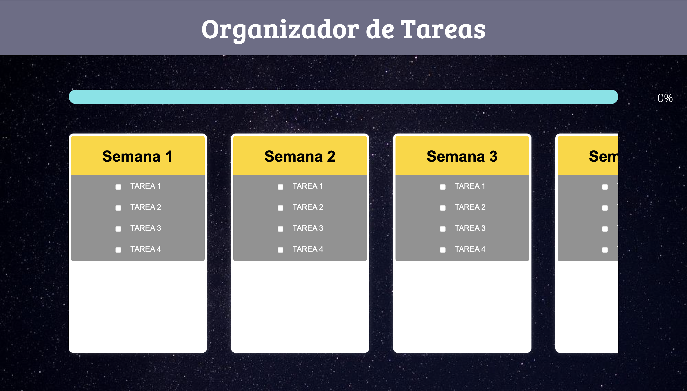

# Organizador de Tareas

Este es un organizador (temporalmente estático) de tareas basado en columnas, donde cada columna representa un periodo de tiempo (días, semanas, etc.). Dentro de cada columna, los usuarios pueden agregar tareas con casillas de verificación para su seguimiento y en la parte superior encontramos una barra que mide el cumplimiento general del proyecto en curso.

## Tecnologías Utilizadas

  
  
  

## Características
- Organización de tareas en columnas.
- Cada columna representa un periodo de tiempo (día, semana, etc.).
- Posibilidad de agregar tareas dentro de cada columna.
- Cada tarea cuenta con un checkbox para marcar su finalización.

## Mejoras Futuras
- Añadir y quitar tareas y columnas dinámicamente.
- Personalización de los textos.
- Función de detalles de tareas:
  - Al presionar el título de una tarea, se abre un popup con los detalles.
  - La ventana emergente muestra:
    - Autor o responsable de la tarea.
    - Título de la tarea.
    - Descripción detallada.
    - Plazo de entrega.
    - Estado de la tarea.
    - Comentarios adicionales.

## Instalación y Uso
1. Clona este repositorio.
2. Abre el archivo `index.html` en tu navegador.
3. ¡Empieza a organizar tus tareas de manera eficiente!

---

Este proyecto está en desarrollo y cualquier sugerencia es bienvenida.

---

Autor: MatiasSF04